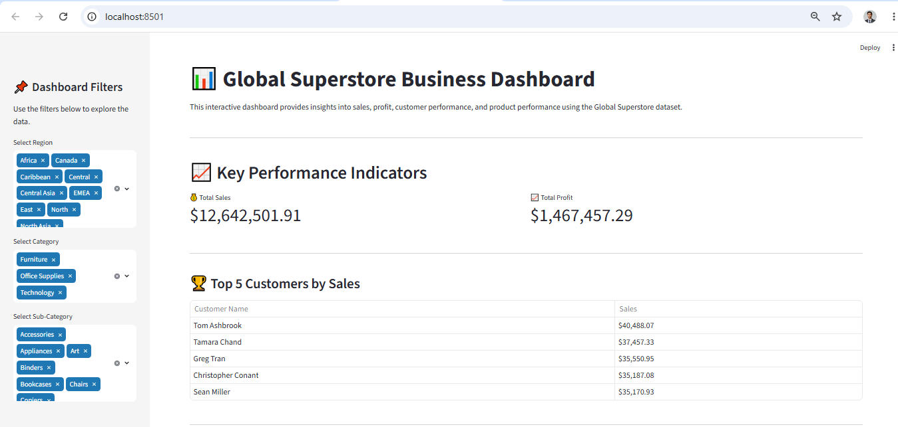
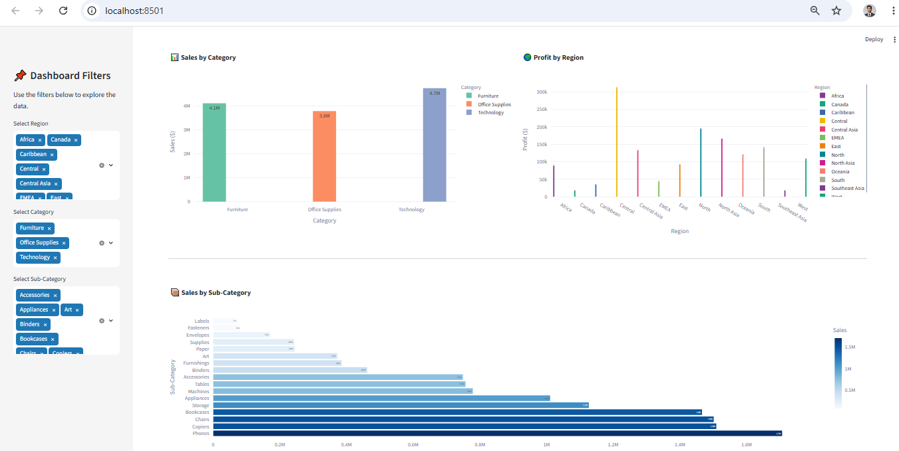

<<<<<<< HEAD
# 📊 Global Superstore Business Dashboard

## 📌 Project Overview

This project is an interactive Business Intelligence (BI) dashboard built using Streamlit, Pandas, and Plotly. It allows users to analyze sales, profit, customer performance, and product performance using the Global Superstore dataset.

## 🚀 Features

- Interactive Region Filter
- Interactive Category Filter
- Interactive Sub-Category Filter
- Total Sales KPI
- Total Profit KPI
- Top 5 Customers by Sales
- Sales by Category Chart
- Profit by Region Chart
- Sales by Sub-Category Chart

## 🛠 Technologies Used

- Python
- Streamlit
- Pandas
- Plotly

## 📂 Project Files

- app.py
- cleaned_superstore.csv
- Global_Superstore.csv
- Data_Cleaning.ipynb
- requirements.txt

## ▶️ Run the Project

```bash
pip install -r requirements.txt
streamlit run app.py
```
## 📷 Dashboard Preview

## 📷 Dashboard Preview


## 📷 Dashboard Preview


##  Author

**Abdul Baqi**

Internship Project
=======
# Global-Superstore-Streamlit-Dashboard
Interactive Business Intelligence Dashboard built with Streamlit, Pandas, and Plotly.

>>>>>>> 93417013b4e701aa587a0c7501d392bc7c9d1fb2
